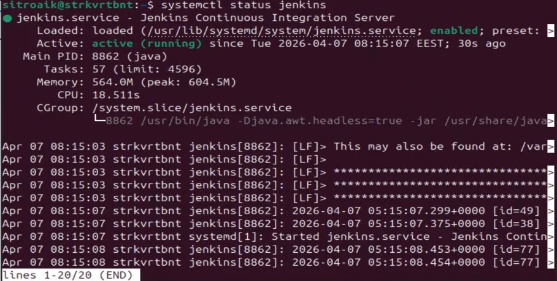
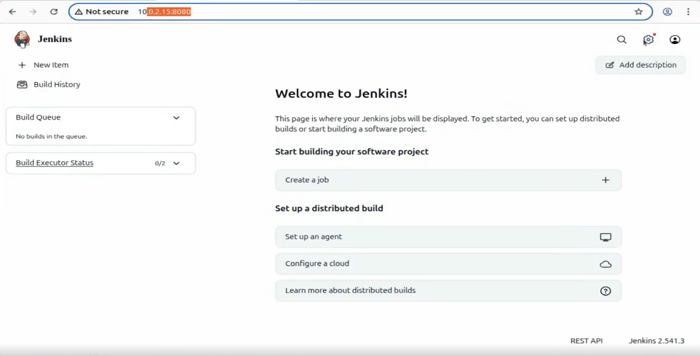
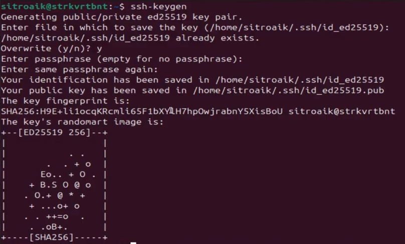
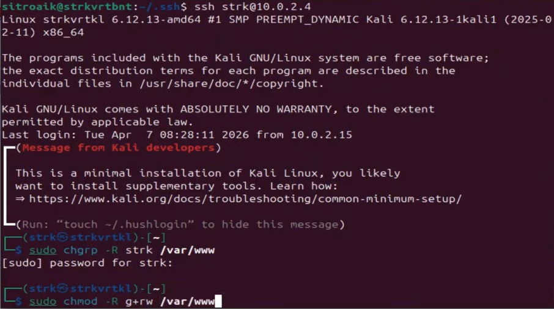
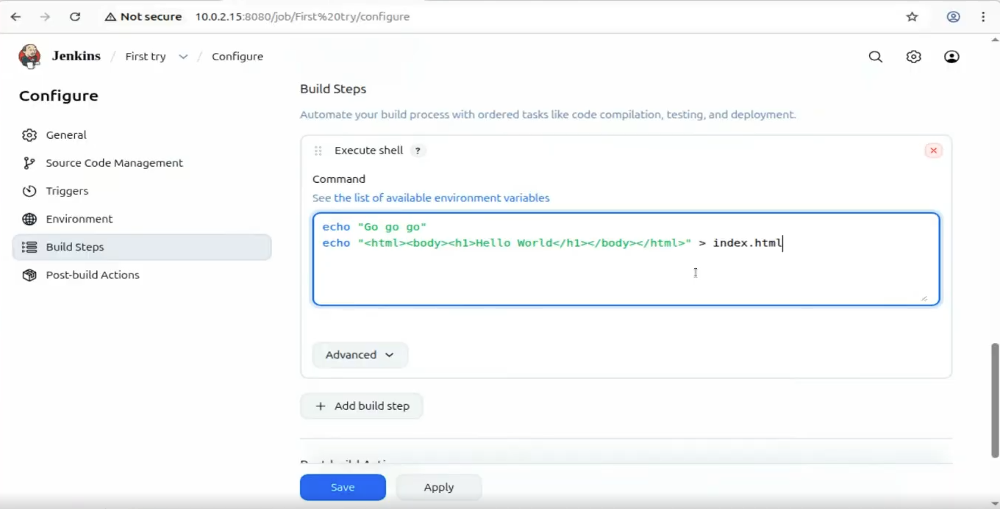
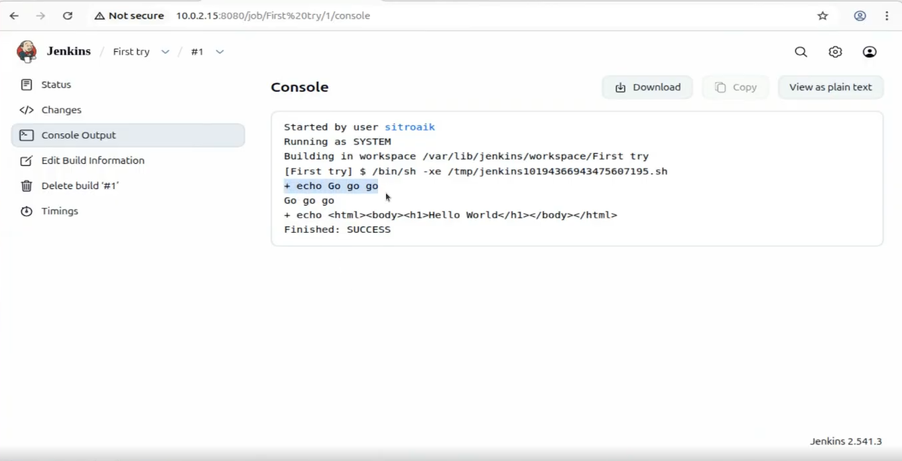
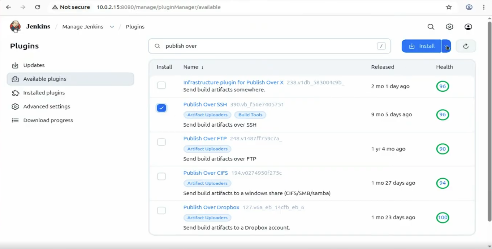
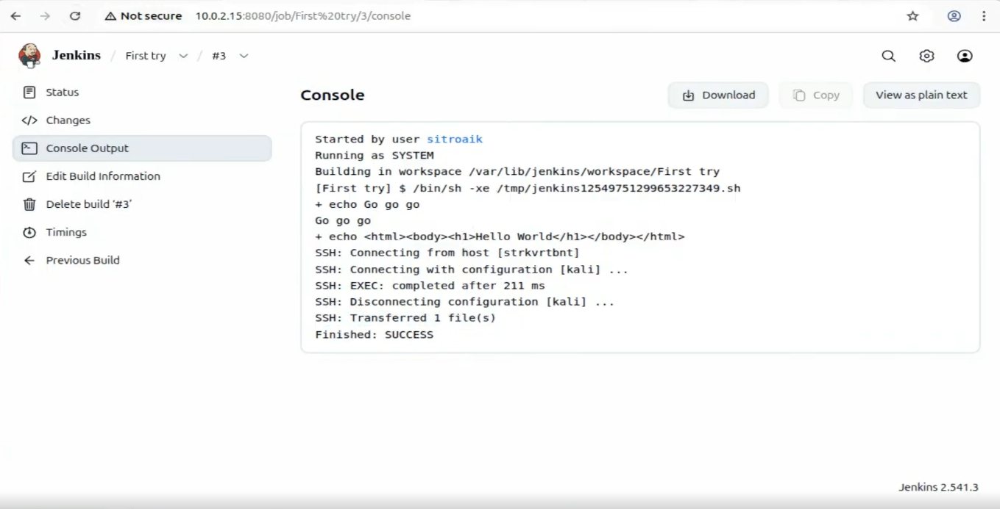
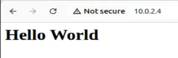
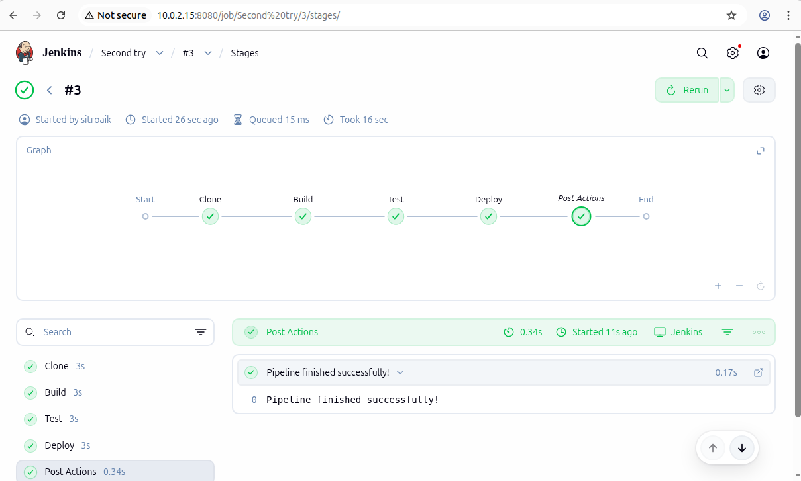

# Звіт про виконану роботу з Jenkins

## Мета роботи

Виконати налаштування Jenkins та реалізувати CI/CD процес між двома машинами:

1. Запустити Jenkins на окремій машині.
2. Налаштувати SSH-обмін ключами між Jenkins-сервером та сервером з вебсервісом.
3. Створити pipeline у Jenkins для автоматичного оновлення контенту на вебсервері.
4. Створити другий pipeline зі stage-ами для демонстрації роботи Jenkins Pipeline.

---

# 1. Запуск Jenkins

Було перевірено стан служби Jenkins через `systemctl status jenkins`.

<<<<<<< HEAD

=======
.png)
>>>>>>> df38097491f56029b5c3f4cee79e72d73ccd403f

На скріншоті видно:

* служба `jenkins.service` активна;
* Jenkins успішно запущений;
* сервіс працює на Java.

---

## Відкриття вебінтерфейсу Jenkins

Після запуску Jenkins вебінтерфейс став доступний через браузер за адресою:

```bash
http://10.0.2.15:8080
```

<<<<<<< HEAD

=======
.png)
>>>>>>> df38097491f56029b5c3f4cee79e72d73ccd403f

---

# 2. Налаштування SSH-обміну ключами

Для організації безпарольного підключення між Jenkins та сервером вебсервера було створено SSH-ключі.

Команда:

```bash
ssh-keygen
```

<<<<<<< HEAD

=======
.png)
>>>>>>> df38097491f56029b5c3f4cee79e72d73ccd403f

Після генерації ключі були передані на сервер з вебсервісом.

---

## Перевірка SSH-підключення

Було виконано SSH-підключення до другої машини.

<<<<<<< HEAD

=======
.png)
>>>>>>> df38097491f56029b5c3f4cee79e72d73ccd403f

Підключення виконано успішно.

---

## Налаштування прав для вебкаталогу

Для можливості деплою Jenkins отримав доступ до каталогу вебсервера `/var/www`.

Використані команди:

```bash
sudo chgrp -R strk /var/www
sudo chmod -R g+rw /var/www
```

---

# 3. Створення pipeline для деплою контенту

Було створено Jenkins Job для автоматичного оновлення контенту вебсервера.

У Build Steps використано shell-команди:

```bash
echo "Go go go"
echo "<html><body><h1>Hello World</h1></body></html>" > index.html
```

<<<<<<< HEAD

=======
.png)
>>>>>>> df38097491f56029b5c3f4cee79e72d73ccd403f

---

## Перевірка виконання Job

Після запуску Job Jenkins успішно виконав build.

<<<<<<< HEAD

=======
.png)
>>>>>>> df38097491f56029b5c3f4cee79e72d73ccd403f

У консолі видно:

* виконання shell-команд;
* створення файлу `index.html`;
* статус `SUCCESS`.

---

## Встановлення Publish Over SSH

Для передачі контенту на вебсервер було встановлено плагін:

* `Publish Over SSH`

<<<<<<< HEAD

=======
.png)
>>>>>>> df38097491f56029b5c3f4cee79e72d73ccd403f

---

## Результат деплою

Після запуску pipeline Jenkins виконав передачу файлу на сервер через SSH.

<<<<<<< HEAD

=======
.png)
>>>>>>> df38097491f56029b5c3f4cee79e72d73ccd403f

У логах видно:

* SSH-підключення;
* передачу файлів;
* успішне завершення build.

---

## Перевірка роботи вебсервера

Після деплою сторінка стала доступною через браузер.

<<<<<<< HEAD

=======
.png)
>>>>>>> df38097491f56029b5c3f4cee79e72d73ccd403f

На сторінці відображається:

```html
Hello World
```

---

# 4. Створення pipeline зі stage-ами

Було створено другий Jenkins Pipeline для демонстрації stage-based pipeline.

Pipeline складався зі stage-ів:

* Clone
* Build
* Test
* Deploy
* Post Actions

---

## Відображення проходження stage-ів

<<<<<<< HEAD

=======
.png)
>>>>>>> df38097491f56029b5c3f4cee79e72d73ccd403f

На графіку видно:

* послідовне проходження всіх stage-ів;
* успішне завершення pipeline;
* статус `Pipeline finished successfully`.

---

# Висновок

У ході роботи було:

* встановлено та запущено Jenkins;
* налаштовано SSH-обмін ключами між двома машинами;
* реалізовано автоматичний деплой контенту на вебсервер;
* встановлено та налаштовано Publish Over SSH;
* створено Jenkins Pipeline зі stage-ами;
* перевірено успішне проходження всіх етапів CI/CD процесу.

Отримано практичні навички роботи з Jenkins, SSH та автоматизацією процесу деплою.
